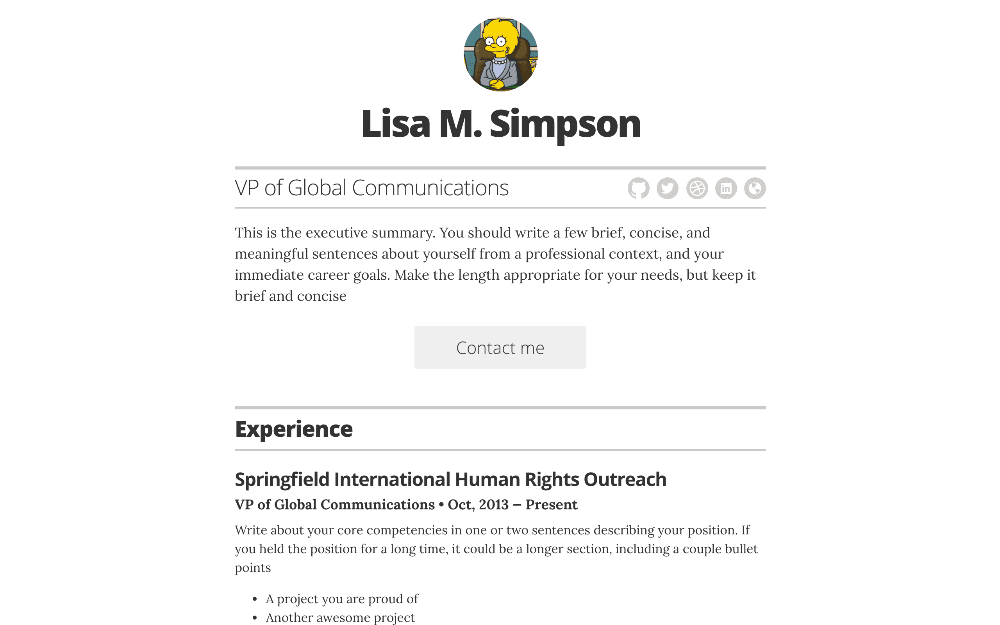

# Resume template

*A simple Jekyll + GitHub Pages powered resume template.*

## Docs

### Running locally

To test locally, run the following in your terminal:

1. Clone repo locally
1. Install the Ruby version in `.ruby-version` (also used by GitHub Actions)
1. `bundle install`
2. `bundle exec jekyll serve`
3. Open your browser to `localhost:4000`

### Running locally with Docker

To test locally with docker, run the following in your terminal after installing docker into your system:

1. `docker image build -t resume-template .`
2. `docker run --rm --name resume-template -v "$PWD":/home/app --network host resume-template`

### Customizing

First you'll want to fork the repo to your own account. Then clone it locally and customize, or use the GitHub web editor to customize.

#### Options/configuration

Most of the basic customization will take place in the `/_config.yml` file. Here is a list of customizations available via `/_config.yml`:

[...write these out...]

#### Editing content

Most of the content configuration will take place in the `/_layouts/resume.html` file. Simply edit the markup there accordingly

### Publishing to GitHub Pages for free

The site builds with Jekyll 4 and explicitly declared plugins rather than the
`github-pages` gem. The theme is local (`_layouts`, `_includes`, and `_sass`);
`jekyll-remote-theme` and its `rubyzip` dependency are not needed.

In repository **Settings → Pages → Build and deployment**, set **Source** to
**GitHub Actions** when activating this workflow. The workflow in
`.github/workflows/pages.yml` checks pull requests and builds and deploys pushes
to `main`. It can also be run manually on `main`. Pull requests never deploy.
The build uses an empty base URL for the root-level custom domain `davidgitman.com`;
keep `CNAME` and the existing domain/DNS configuration.

Before deployment, run `JEKYLL_ENV=production bundle exec jekyll build --trace`
and check the generated HTML, CSS, sitemap, and custom domain file in `_site`.
Commit `Gemfile.lock` changes with dependency updates so CI uses the same versions.

### Configuring with your own domain name

To setup your GH Pages site with a custom domain, [follow the instructions](https://help.github.com/articles/setting-up-a-custom-domain-with-github-pages/) on the GitHub Help site for that topic.

### Themes

Right now resume-template only has one theme. More are coming :soon: though. :heart:

## Roadmap

A feature roadmap is [available here](https://github.com/jglovier/resume-template/projects/1). If you features suggestions, please [open a new issue](https://github.com/jglovier/resume-template/issues/new).

## Contributing

If you spot a bug, or want to improve the code, or even make the dummy content better, you can do the following:

1. [Open an issue](https://github.com/jglovier/resume-template/issues/new) describing the bug or feature idea
2. Fork the project, make changes, and submit a pull request

## License

The code and styles are licensed under the MIT license. [See project license.](LICENSE) Obviously you should not use the content of this demo repo in your own resume. :wink:

Disclaimer: Use of Lisa M. Simpson image and name used under [Fair Use](https://en.wikipedia.org/wiki/Fair_use) for educational purposes. Project license does not apply to use of this material.
